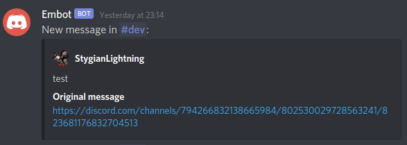

# embot
Discord bot that "redirects" messages to other channels via embeds.  
It is intended to be used for servers with channels meant only for images, clips or other showcase material
that have a dedicated discussion channel for this material. 
This is impossible to do without bots as Discord doesn't support replying to a message from another channel.

This is where `embot` comes into play: it embeds the content of the original message in a message in another channel.
See the following images for examples:



For messages that have at least one embed (like gifs),
embot will set the title of the embed it generates to a link to the original content.
Unfortunately, embedding gifs and images directly into a message is limited to the Discord backend and 
is only done for human users, not for bots.


## Usage

### Linking Channels

You need to link channels in order to have `embot` "redirect" messages to another channel.

Run the `;link` command in the channel you want to link messages from (e.g. the clips channel)
and pass in the target channel you want `embot` to write the messages to (e.g. the discussion channel) 
```
;link #TARGET_CHANNEL
```

`embot` saves a mapping from the source to the target channel.
One channel can only be linked to one other channel at any point in time.
If you want embot to point to a different channel, simply use the `;link` command again and pass
in the new channel you want to redirect messages to.

This command is only available for administrators and the owner of a server.

## Installation

Currently, there is no official server for embot; it's being run from a Raspberry Pi.  
If you want to host it yourself, you will need to create a Discord application for the bot; 
follow the steps on [the official Discord documentation](https://discord.com/developers/docs/intro).


### Environment variables

`embot` relies on the environment variable `EMBOT_DISCORD_TOKEN` to get the Discord token. 
Make sure you `export` your Discord token to this environment variable. Under no circumstances should you share your 
Discord tokens with third parties or put them in a public repository.

With this environment variable set, running `embot` is as simple as `cargo run`.

### Systemd configuration

While you can run `embot` with `cargo run`, you may prefer a more robust way of running the bot.
Systemd is a Linux tool that allows you to configure services that are started after your device has
finished booting and restarting them when they crash.
It is optional, but very useful if you want to run applications like Discord bots from a Raspberry Pi.

You can use the following systemd configuration as a template:

```
[Unit]
Description=embot

[Service]
Environment=EMBOT_DISCORD_TOKEN=<YOUR_TOKEN_HERE>
ExecStart=<PATH_TO_EMBOT_EXE>
Type=idle
Restart=always
RestartSec=15
RestartPreventExitStatus=0
TimeoutStopSec=10

[Install]
WantedBy=multi-user.target
```

Replace YOUR_TOKEN_HERE with your Discord app token (the same one you would export as `EMBOT_DISCORD_TOKEN`) 
and <PATH_TO_EMBOT_EXE> to point to the `embot` executable. 
If you just build embot with `cargo build` or `cargo run`, this path will be `./target/debug/embot` (relative to the project root);
if you do a `--release` build, you will find it under `./target/release/embot`. You can copy these executables to another location of your choosing;
the other files in the `target` directory are not necessary to run `embot`.

Save this configuration under `/etc/systemd/system/embot@.service` (this will probably require sudo privileges).
 
Running `embot` with `systemd`:
- You can enable systemd to automatically start `embot` with `sudo systemctl enable embot@one` (you can name the service differently).
- After you `enable` `embot`, it will automatically start once you reboot your device. You can also start it manually with
  `sudo systemctl start embot@one` 
  (make sure the service name matches the name you chose above).
- In order to stop the running service, `sudo systemctl stop embot@one` 
  (make sure the service name matches the name you chose above).
- If you want to check on the logs, use `systemctl status embot@one`
  (make sure the service name matches the name you chose above).
